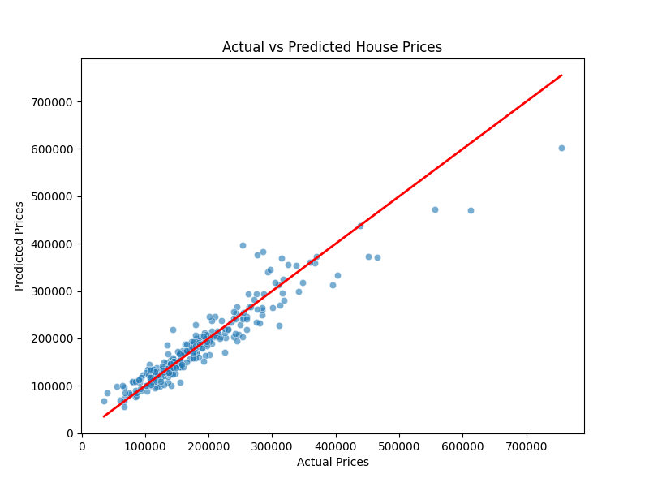
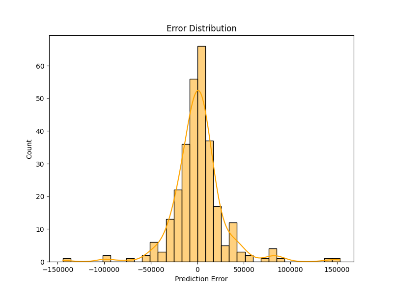

# 🏠 House Price Prediction using XGBoost

This project predicts house prices based on property features using **Machine Learning**.  
It uses the **Ames Housing Dataset** and implements an **XGBoost Regressor** for high-accuracy predictions.  

---

## 📖 Table of Contents
- [Overview](#-overview)
- [Dataset](#-dataset)
- [Technologies Used](#-technologies-used)
- [Project Workflow](#-project-workflow)
- [Results](#-results)
- [Installation & Usage](#-installation--usage)
- [Future Improvements](#-future-improvements)
- [License](#-license)
- [Acknowledgments](#-acknowledgments)

---

## 📌 Overview

The project includes:
- Data preprocessing (handling missing values, encoding categories, scaling)
- Model training using **XGBoost**
- Model evaluation (RMSE, R² Score)
- Visualization of predictions and errors
- Saving the trained model for future use

---

## 📂 Dataset
- **Source:** [Kaggle - House Prices: Advanced Regression Techniques](https://www.kaggle.com/c/house-prices-advanced-regression-techniques)
- **Rows:** 1460  
- **Columns:** 81 (including both numerical and categorical features)  
- **Target Variable:** `SalePrice`

---

## 🛠 Technologies Used
- **Python** (3.x)
- **Pandas** – Data handling
- **NumPy** – Numerical operations
- **Matplotlib & Seaborn** – Visualization
- **Scikit-learn** – Preprocessing & metrics
- **XGBoost** – Gradient boosting regression
- **Joblib** – Model persistence

---

## Visualize Results

📈 Actual vs Predicted Prices
📊 Error Distribution Histogram

---

## 📊 Results

RMSE: ~28,064 (lower is better)
R² Score: ~0.8973 (closer to 1 is better)
Insights: Model explains ~89.7% of price variance

---

## 🚀 Installation & Usage
1. Clone the repository:
   ```bash
   git clone https://github.com/your-username/house-price-prediction.git
   cd house-price-prediction
2. Create Virtual Environment:
   ```bash
   python -m venv env
   # Activate:
     # Windows
       env\Scripts\activate
     # Mac/Linux
       source env/bin/activate
3. Install dependencies:
    ```bash
    pip install -r requirements.txt
4. Run the script:
   ```bash
   python house_price_prediction.py
   
---

## 📸 Screenshots

| Prediction Error | Error Distribution |
|------------------|-----------------|
|  |  |

---

## 📜 License
 This project is licensed under the MIT License

 ---

## 🙌 Acknowledgments

Kaggle - House Prices Dataset
XGBoost Documentation

